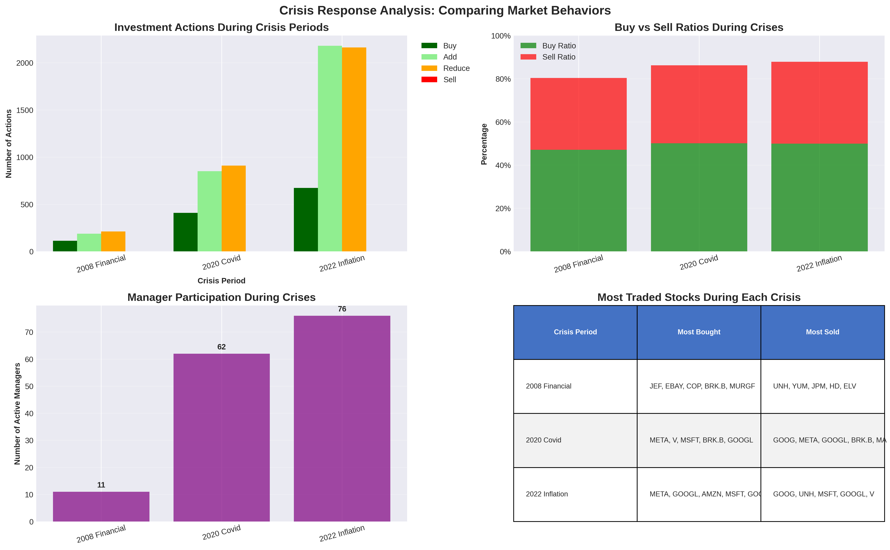
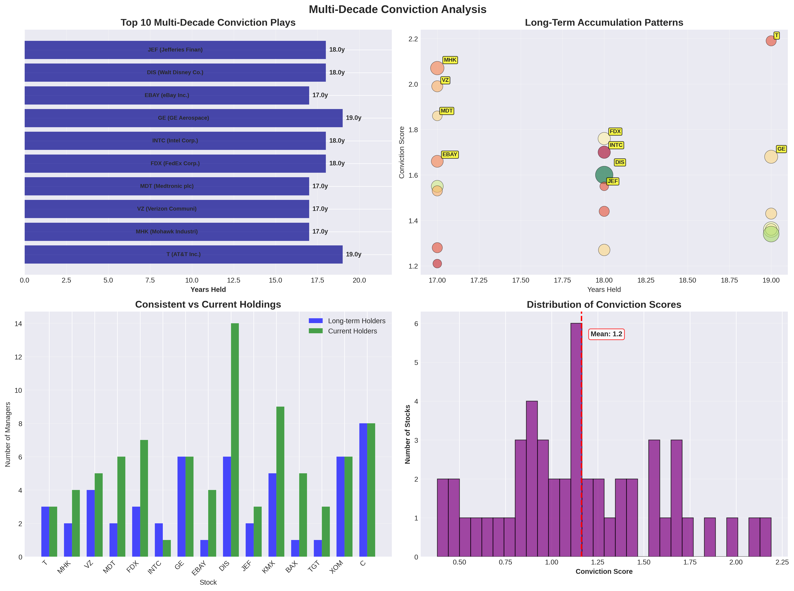
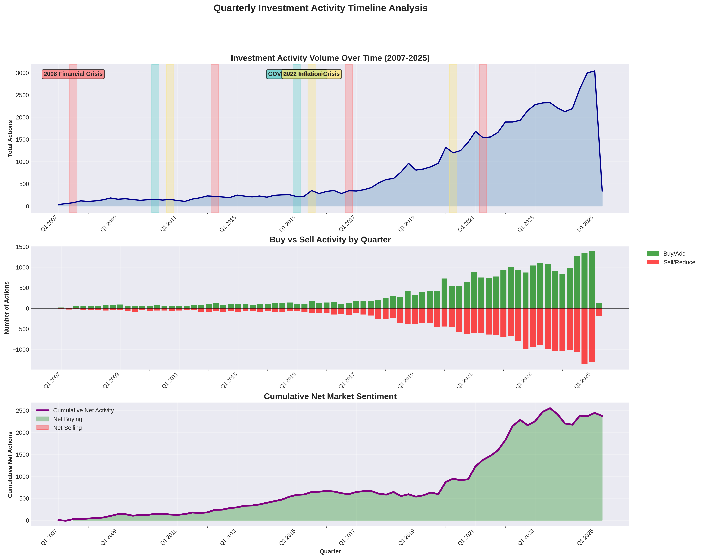
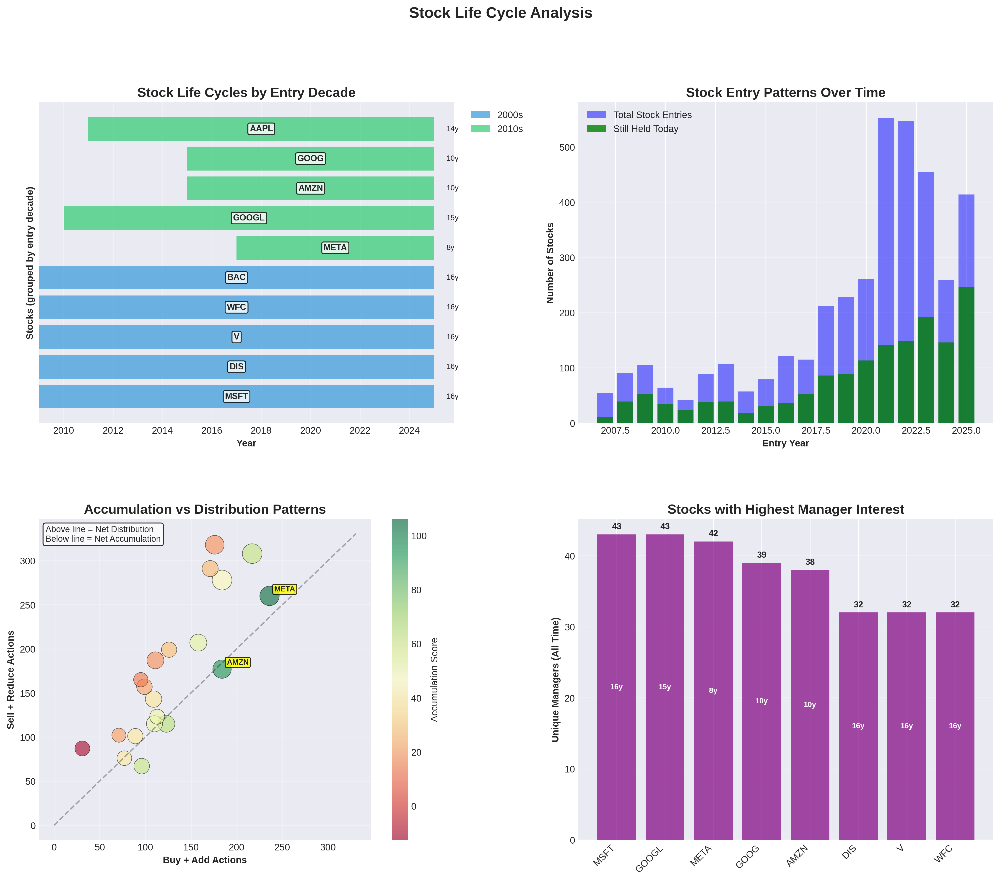

# 📊 Dataroma Investment Analysis

*Generated: 2025-07-25 08:03:44*

## 🎯 Overview

This analysis covers **18+ years** of investment data from top money managers, providing insights into current opportunities, manager performance patterns, and long-term investment trends.

### 📈 Quick Stats
- **Total Activities Analyzed**: 57,643
- **Current Holdings**: 3,311
- **Managers Tracked**: 81
- **Time Period**: 2007-2025

---

## 💡 Current Analysis (Last 3 Quarters)

Immediate opportunities and recent market activity from Q4 2022 to Q4 2024.

### 📊 Visual Analysis

#### 52 Week Analysis Current

#### Momentum Analysis Current

#### New Positions Current

#### Low Price Accumulation Current

#### Portfolio Changes Current

#### Price Opportunities Current

### 📋 Current Reports

| Report | Description | Key Insight |
| ------ | ----------- | ----------- |
| [52_week_high_sells.csv](current/52_week_high_sells.csv) | Profit taking patterns (40 items) | Strategic exits at peaks |
| [52_week_low_buys.csv](current/52_week_low_buys.csv) | Value hunting activity (40 items) | Managers buying at market lows |
| [concentration_changes.csv](current/concentration_changes.csv) | Portfolio shifts (100 items) | Major allocation adjustments |
| [contrarian_opportunities.csv](current/contrarian_opportunities.csv) | Against-the-trend plays (30 items) | Institutional contrarian bets |
| [deep_value_plays.csv](current/deep_value_plays.csv) | Deep value opportunities (30 items) | Undervalued institutional picks |
| [high_conviction_low_price.csv](current/high_conviction_low_price.csv) | Best value + conviction combo (30 items) | High conviction meets low price |
| [highest_portfolio_concentration.csv](current/highest_portfolio_concentration.csv) | Most focused positions (100 items) | Highest concentration institutional bets |
| [momentum_stocks.csv](current/momentum_stocks.csv) | Recent buying activity (50 items) | Tracks institutional accumulation patterns |
| [most_sold_stocks.csv](current/most_sold_stocks.csv) | Recent exit activity (50 items) | Most divested institutional positions |
| [new_positions.csv](current/new_positions.csv) | Fresh acquisitions (100 items) | Identifies emerging manager interests |
| [stocks_under_$5.csv](current/stocks_under_$5.csv) | Ultra-low price opportunities (50 items) | Deep value plays under $5 |
| [stocks_under_$10.csv](current/stocks_under_$10.csv) | Sub-$10 opportunities (50 items) | Manager favorites under $10 |
| [stocks_under_$20.csv](current/stocks_under_$20.csv) | Affordable growth plays (50 items) | Quality stocks at accessible prices |
| [stocks_under_$50.csv](current/stocks_under_$50.csv) | Mid-price value plays (50 items) | Institutional picks under $50 |
| [stocks_under_$100.csv](current/stocks_under_$100.csv) | Sub-$100 opportunities (50 items) | Value plays under $100 |
| [under_radar_picks.csv](current/under_radar_picks.csv) | Hidden gem opportunities (20 items) | Under-the-radar institutional picks |
| [value_price_opportunities.csv](current/value_price_opportunities.csv) | Multi-tier price analysis (40 items) | Comprehensive price-based screening |

### 🔍 Top 15 Under Radar Picks

| Rank | Ticker | Score | Value | Why Under Radar |
| ---- | ------ | ----- | ----- | --------------- |
| 1 | **BBWI** | 33.3 | $50M | Exclusive pick; High conviction (16.7%); Single manager exclusive; Recent discovery; Low price entry |
| 2 | **AER** | 24.7 | $116M | Exclusive pick; High conviction (12.3%); Single manager exclusive |
| 3 | **AMR** | 22.1 | $53M | Limited recognition; High conviction (11.2%); Growing institutional interest; Recent discovery |
| 4 | **ABG** | 16.5 | $466M | Exclusive pick; Single manager exclusive |
| 5 | **ACI** | 16.5 | $76M | Exclusive pick; Growing institutional interest; Low price entry |
| 6 | **BAYRY** | 16.0 | $40M | Exclusive pick; Growing institutional interest; Low price entry |
| 7 | **BFH** | 14.1 | $16M | Exclusive pick; Growing institutional interest |
| 8 | **AME** | 12.4 | $168M | Exclusive pick; Growing institutional interest |
| 9 | **BELFB** | 12.3 | $18M | Exclusive pick; Single manager exclusive |
| 10 | **ACGL** | 9.6 | $416M | Exclusive pick; Growing institutional interest |
| 11 | **BB** | 9.5 | $181M | Limited recognition; Growing institutional interest; Low price entry |
| 12 | **ALC** | 8.7 | $812M | Limited recognition; Growing institutional interest |
| 13 | **ATS** | 6.6 | $61M | Exclusive pick; Growing institutional interest; Low price entry |
| 14 | **AMG** | 5.9 | $57M | Limited recognition; Growing institutional interest |
| 15 | **AN** | 4.2 | $189M | Limited recognition; Growing institutional interest |

---

## 🧠 Advanced Analysis (Manager Performance)

Deep insights into manager strategies, performance patterns, and decision-making.

### 📊 Visual Analysis

#### Manager Performance Advanced

#### Top Holdings Advanced

#### 3 Year Performance

#### 5 Year Performance

#### 10 Year Performance

#### Comprehensive Performance

#### Consensus Picks Advanced

#### Crisis Alpha Advanced

#### Manager Evolution Advanced

#### Position Sizing Advanced

### 📋 Advanced Reports

| Report | Description | Key Insight |
| ------ | ----------- | ----------- |
| [action_sequence_patterns.csv](advanced/action_sequence_patterns.csv) | Trading pattern analysis (30 items) | Institutional buy/sell sequence patterns |
| [catalyst_timing_masters.csv](advanced/catalyst_timing_masters.csv) | Market timing excellence (30 items) | Managers with exceptional timing skills |
| [crisis_alpha_generators.csv](advanced/crisis_alpha_generators.csv) | Crisis period outperformers (30 items) | Managers who buy during crashes |
| [high_conviction_stocks.csv](advanced/high_conviction_stocks.csv) | Highest conviction positions (245 items) | Stocks with strongest institutional backing |
| [interesting_stocks_overview.csv](advanced/interesting_stocks_overview.csv) | Top-tier opportunities (100 items) | Multi-factor scoring of elite picks |
| [long_term_winners.csv](advanced/long_term_winners.csv) | Sustained institutional interest (132 items) | Stocks with long-term institutional backing |
| [manager_evolution_patterns.csv](advanced/manager_evolution_patterns.csv) | Strategy adaptation over time (30 items) | How managers evolve their approaches |
| [manager_performance.csv](advanced/manager_performance.csv) | Comprehensive manager evaluation (81 items) | Multi-dimensional performance metrics |
| [manager_track_records.csv](advanced/manager_track_records.csv) | 18+ year performance history (81 items) | Comprehensive manager scoring with consistency |
| [multi_manager_favorites.csv](advanced/multi_manager_favorites.csv) | Consensus high-conviction picks (50 items) | Stocks held by multiple elite managers |
| [position_sizing_mastery.csv](advanced/position_sizing_mastery.csv) | Optimal allocation patterns (40 items) | Advanced portfolio construction analysis |
| [sector_rotation_excellence.csv](advanced/sector_rotation_excellence.csv) | Elite sector allocation (30 items) | Superior sector rotation strategies |
| [sector_rotation_patterns.csv](advanced/sector_rotation_patterns.csv) | Institutional sector flows (352 items) | Sector rotation trend analysis |
| [theme_emergence_detection.csv](advanced/theme_emergence_detection.csv) | Early theme identification (25 items) | Emerging investment theme detection |
| [top_holdings.csv](advanced/top_holdings.csv) | Largest institutional positions (50 items) | Deep dive into major institutional holdings |

### 🏆 Top 15 Managers by Annual Return (2007-2025)

| Rank | Manager | Annual Return | Score | Years Active |
| ---- | ------- | ------------- | ----- | ------------ |
| 1 | **Mason Hawkins** | 26.9% | 30.21 | 19 |
| 2 | **Tweedy Browne Co.** | 26.9% | 27.79 | 19 |
| 3 | **Hillman Value Fund** | 26.9% | 27.71 | 19 |
| 4 | **Bill Ackman** | 26.9% | 27.69 | 19 |
| 5 | **Bill Nygren** | 26.9% | 26.78 | 19 |
| 6 | **Bruce Berkowitz** | 26.9% | 24.37 | 19 |
| 7 | **Ruane Cunniff** | 26.9% | 24.18 | 19 |
| 8 | **Bill & Melinda Gates Foundation Trust** | 26.9% | 18.49 | 19 |
| 9 | **Warren Buffett** | 25.3% | 28.38 | 18 |
| 10 | **Wallace Weitz** | 23.9% | 28.78 | 17 |
| 11 | **Mohnish Pabrai** | 23.9% | 18.94 | 17 |
| 12 | **Glenn Greenberg** | 22.5% | 28.26 | 16 |
| 13 | **Charles Bobrinskoy** | 21.2% | 27.32 | 15 |
| 14 | **Chuck Akre** | 21.2% | 26.87 | 15 |
| 15 | **Prem Watsa** | 21.2% | 26.78 | 15 |

---

## 📚 Historical Analysis (18+ Years)

Long-term trends and patterns from 2007 to 2025.

### 📊 Visual Analysis

#### Crisis Response Comparison

#### Multi Decade Conviction

#### Quarterly Activity Timeline

#### Stock Life Cycles

### 📋 Historical Reports

| Report | Description | Key Insight |
| ------ | ----------- | ----------- |
| [crisis_response_analysis.csv](historical/crisis_response_analysis.csv) | 2008 vs 2020 comparison (3 items) | Crisis behavior patterns across decades |
| [multi_decade_conviction.csv](historical/multi_decade_conviction.csv) | Stocks held 10+ years (50 items) | Ultimate long-term conviction plays |
| [quarterly_activity_timeline.csv](historical/quarterly_activity_timeline.csv) | 18-year activity map (74 items) | 73 quarters of market timing insights |
| [stock_life_cycles.csv](historical/stock_life_cycles.csv) | Complete holding patterns (3851 items) | Entry/exit patterns and optimal holding periods |

---

## 📐 Methodology

### Scoring Algorithms

#### Hidden Gem Score (0-10)
- **Exclusivity Factor** (30%): Fewer managers = higher score
- **Conviction Factor** (25%): Higher portfolio % = higher score
- **Recent Activity** (20%): Recent buys boost score
- **Momentum Factor** (15%): Multiple recent transactions
- **Manager Quality** (10%): Premium for top-tier managers

#### Track Record Score
- **Win Rate**: Percentage of successful investments
- **Consistency**: Performance stability over time
- **Crisis Alpha**: Outperformance during downturns
- **Longevity**: Years of active management

### Data Processing
- **Temporal Accuracy**: 100% validated quarter extraction
- **Price Data**: Real-time from Dataroma HTML
- **Manager Mapping**: Clean names without timestamps
- **Activity Types**: Buy, Sell, Add, Reduce, Hold

### Analysis Periods

---

## 📅 Update Schedule

This analysis is refreshed monthly to capture the latest investment trends and manager activities.

## 🔗 Data Source

All data is sourced from [Dataroma](https://www.dataroma.com), tracking portfolios of super investors.

---

*Analysis framework powered by modular Python architecture with 100% data accuracy validation*